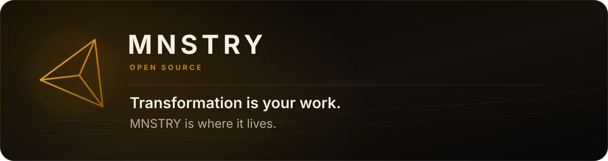

<p align="center">
  
</p>

<p align="center">
  <a href="https://mnstry.ai">MNSTRY.ai</a> ·
  <a href="https://docs.mnstry.ai">Documentation</a> ·
  <a href="https://mnstry.org">Research and writing</a>
</p>

## Your methodology becomes a living digital experience

MNSTRY builds consent-native technology for practitioner-led transformation. Sessions, programs, spaces, and companions carry the work between moments of human contact while keeping privacy, consent, and exit inside the design.

The public work begins one layer lower. We open the local tools, contracts, and verification that keep important bodies of work readable, portable, and under their stewards' control.

Not everything MNSTRY builds is open source. Everything listed below is.

## Open source now

<!-- mnstry:repositories:start -->
### [MNSTRY Atelier](https://github.com/MNSTRY/atelier)

Local governance toolkit for file-based bodies of work. Front-matter ontology, deterministic knowledge graph, fail-closed boundaries, offline conformance.

JavaScript · Apache-2.0 · [v0.2.0-alpha.4](https://github.com/MNSTRY/atelier/tree/v0.2.0-alpha.4) · Updated 16 Aug 2026

[Repository](https://github.com/MNSTRY/atelier) · [Documentation](https://docs.mnstry.ai/public-product/developers/atelier) · [Issues](https://github.com/MNSTRY/atelier/issues)

`local-first` `knowledge-graph` `governance` `ontology` `authoring` `validation`

```sh
npm install --save-dev @mnstry/atelier@0.2.0-alpha.4
```
<!-- mnstry:repositories:end -->

## What the open work stands for

**Your files stay yours.** Source remains readable in ordinary files and versioned in Git.

**Rules can refuse.** A boundary is only meaningful when invalid or over-broad states fail instead of passing quietly.

**Exit is part of the product.** Public contracts, offline checks, and a permissive license keep continuation possible without a MNSTRY account or service.

## Work with us

Each repository states its own contribution, disclosure, and security posture. Read those boundaries before opening a pull request. Issues and careful questions are always a good place to begin.

<p align="center"><strong>You can leave. That's why you can stay.</strong></p>

<sub>The repository catalogue is rebuilt daily from the public GitHub API. New public MNSTRY repositories appear automatically. Private repositories are never queried or named.</sub>
